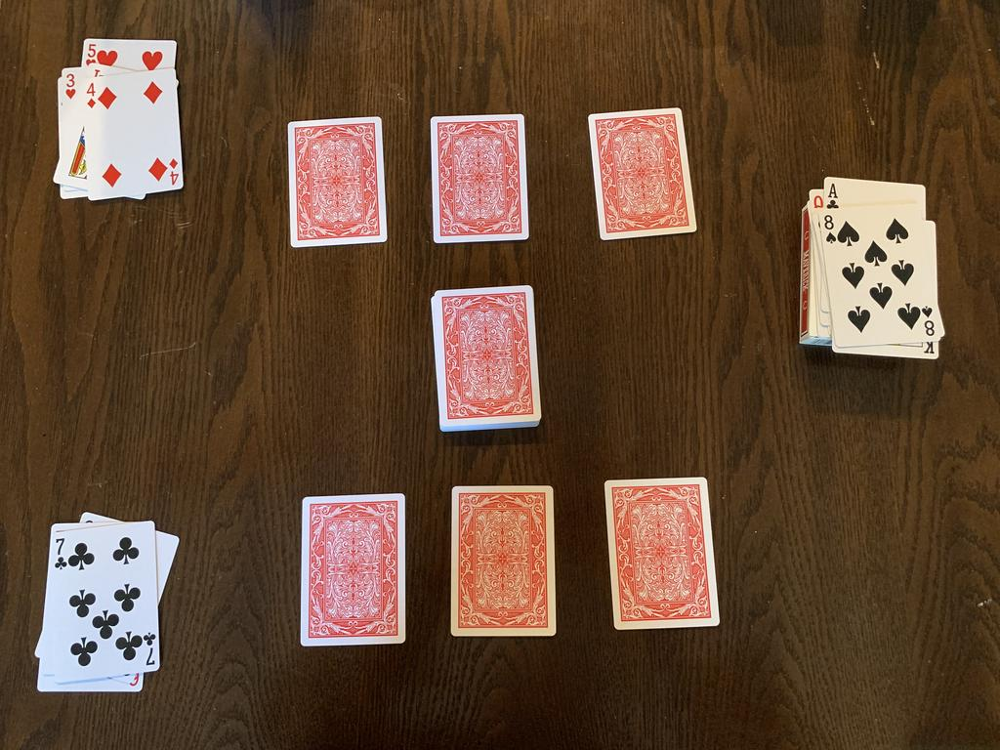

<!-- Name: Site Wei -->
<!-- CPSC 386-03-->
<!-- 2022-02-07 -->
<!-- sitew@csu.fullerton.edu -->
<!-- @wst93444 -->
<!-- # -->
<!-- Lab 00-01 -->
<!-- # -->
<!-- This is my traditional game project. -->
# Lucky Person

2 Players game

## Description

This game is a very traditional game, and it's good for people who older than 6 years old to play it. It it very easy to play with your friend, classmates, and family. You can play it at anywhere. Although it is a very simple game, he is full of unknowns and fantasies. 

### Material

48 cards deck(3,4,5,6,7,8,9,10,Jack,Queen,King,Ace)

### Game Rules

1. 3 is the smallest card, and Ace is the largest.(No suit comparison, only compare rank)
1. Each round gives each player three cards, one at a time, until they have three cards.
1. Players can't look at their cards before playing cards, just pick one card and play them out.
1. If Player 1's card is larger than Player 2's card, then Player 1 gets the card that Player 2 just played out, vice versa.
1. If two players have the same card rank, neither player can get the opponent's card.

### Goals
* The Player who received more cards than the opponent's will win the game.
* The people who wins the game will be the Lucky Person!

### Strategies
Pray before play the game, God will bless you!

This is an image of the game.

Here is a [video on how to play the game.](https://drive.google.com/file/d/1w3Bo5lF6ZVrBO7vSvxMjl2ujsK8U7_OR/view?usp=sharing)