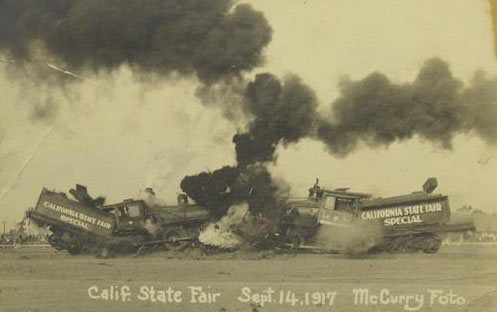

# Your Game Title

_Please remove everything in this README and replace it with your game's README. Follow the advice and instructions below._

Use [Markdown](https://en.wikipedia.org/wiki/Markdown) to format your document. There is a [GitHub specific guide](https://guides.github.com/pdfs/markdown-cheatsheet-online.pdf) that you can download to your computer.

Create a new(-ish) traditional-style game that can be played with common household materials. Please exclude any designs that use alcohol, controlled substances, or can cause physical/emotional pain. Provide instructions on how to play your game and a list of materials needed to play your game. Please illustrate your instructions.

In the README.md you shall:
* give general overview of the game
* describe objectives and strategies
* provide the rules and an explanation of the rules
* illustrate the game, game pieces, application of the rules, etc.

The directory named images should contain all the images you wish to use in the document. You can show images in a Markdown file very easily. Below is an example of how to embed an image. In your final submission, please remove the sample image provided. _Please resize your images to be a reasonable size. Rule of thumb: if an image is larger than 1 MB, resize it._

You are strongly encouraged to create a video of the game play to help players understand how to play the game. Use a smart phone to record the action and post it to an online video sharing service such as YouTube or Vimeo. Link to the video using the videos sharing URL. Do not upload the video to GitHub since it will undoubtedly be too large.